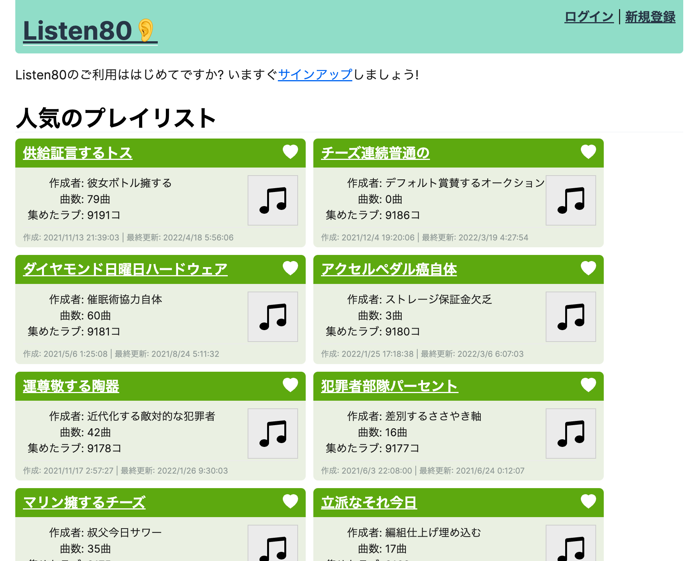

# 社内ISUCON 2022

面白法人カヤックの社内ISUCON 2022年版です。

開催報告blog [カヤック×PR TIMES合同 カヤック社内ISUCONを開催しました](https://techblog.kayac.com/inhouse-isucon-2022)



## 用意されている参考実装

- Node.JS (TypeScript)
- Go

## レギュレーション & 当日マニュアル

[docs/README.md](docs/README.md)

## 起動方法

### Docker Compose

まずこのリポジトリをcloneし、実行に必要なデータを取得するために `make dataset` を実行します。

その後、`webapp` ディレクトリで Docker Compose によって起動できます。

```console
$ git clone https://github.com/kayac/kayac-isucon-2022.git
$ make dataset
$ cd webapp
$ docker-compose up --build
```

初期状態では Node.JS (TypeScript) 実装が起動します。

- Go実装に切り替える場合は [docker-compose.yml](webapp/docker-compose.yml) のコメントを参照してください
- M1 mac (ARM) で動作させる場合、mysqlコンテナを `image: mysql/mysql-server:8.0.28-aarch64` に変更して下さい

初回起動時にはMySQLへデータを読み込むため、起動まで数分かかります。

Go実装は、初回起動時にMySQLに接続できずに異常終了してしまうことがあります。その場合は初回のmysqlコンテナの起動が完了したら、Docker Composeを再起動して下さい。

マニュアル [docs/README.md](docs/README.md) も参照して下さい。

### Amazon EC2 AMI

AWS ap-northeast-1 (東京リージョン) で、以下のAMIからEC2を起動してください。

 AMI ID | AMI name | アーキテクチャ
--------|------|----
ami-06224cd9a615efa7e | kayac-isucon-2022-20220516-0209-x86_64   | X86_64
ami-03d15acedbdf56eab | kayac-isucon-2022-20220516-0209-aarch64  | ARM64 (aarch64)

- TCP port 80 (必要ならSSH用にport 22) を必要に応じて開放してください
  - 初期状態で ssm-agent が起動しています
  - 適切なインスタンスprofileを指定するとSSM Session Managerでログインできるため、sshは必須ではありません
  - SSHでログインする場合、`ubuntu` ユーザーが使用できます
- インスタンスタイプの想定は c6i.xlarge です
  - 社内ISUCON開催時のスペックです。c6i.largeなど、2コアのインスタンスでも動作は可能です
- 競技用に `isucon` ユーザーが存在します
- `/home/isucon` 以下にこのリポジトリが配置されています
- Docker Compose でアプリケーション一式が起動しています
- AMIからインスタンスを起動した直後は、EBS volume の "first touch penalty" のためディスクの読み取りが低速で、ベンチマークが正常に完了しないことがあります
  - 参考 [Amazon EBS ボリュームの初期化](https://docs.aws.amazon.com/ja_jp/AWSEC2/latest/UserGuide/ebs-initialize.html)
  - 起動後に以下の手順でインスタンス上のデータベースファイルを一度読み捨てることで、正常なパフォーマンスを発揮できるようになります
  ```console
  $ sudo -s
  # cat /var/lib/docker/volumes/webapp_mysql/_data/isucon_listen80/* > /dev/null
  ```

マニュアル [docs/README.md](docs/README.md) も参照して下さい。

## ベンチマーク実行方法

### ローカル

Go 1.18.x でビルドして下さい。

```console
$ cd bench
$ make bench
```

ベンチマークの実行にはデータが必要なため、「起動方法 > ローカル + Docker Compose」の `make dataset` を実行して下さい。

EC2 AMIにはビルド済みの `bench` コマンドが配置されています。

### 実行方法 (ローカル, EC2 共通)

```console
$ cd bench
$ ./bench

(略)
17:42:27.650368 SCORE: 600 (+610 -10)
17:42:27.650445 RESULT: score.ScoreTable{"GET /api/playlist/{}":221, "GET /api/playlists":13, "GET /api/popular_playlists":1, "GET /api/popular_playlists (login)":1, "GET /api/recent_playlists":13, "GET /api/recent_playlists (login)":11, "POST /api/login":33, "POST /api/playlist/favorite":175, "POST /api/playlist/{}/add":4, "POST /api/playlist/{}/update":3}
```

出力される `SCORE: 600` が最終的なスコアです。(+が得点 -がエラーによる減点)
算出方法についてはマニュアル [docs/README.md](docs/README.md) も参照して下さい。

何もオプションを指定しない場合、http://localhost に対してベンチマークを実行します。

別のホストに対してベンチマークを実行する場合、`-target-url` を指定して下さい。

### オプション

```
Usage of ./bench:
  -data-dir string
        Data directory (default "data")
  -debug
        Debug mode
  -duration duration
        Benchmark duration (default 1m0s)
  -exit-error-on-fail
        Exit error on fail (default true)
  -initialize-request-timeout duration
        Initialize request timeout (default 30s)
  -prepare-only
        Prepare only
  -request-timeout duration
        Default request timeout (default 15s)
  -skip-prepare
        Skip prepare
  -target-url string
        Benchmark target URL (default "http://localhost")
```


## LICENSE

MIT
